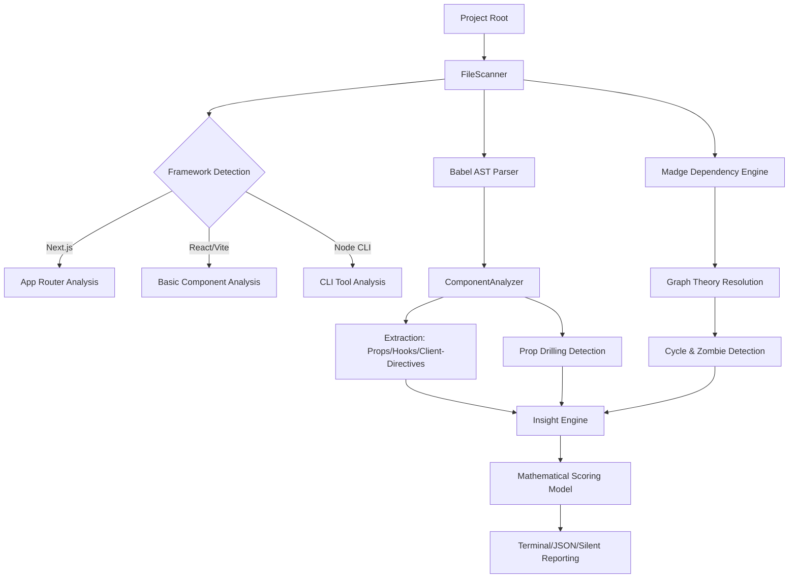

# ReactLens: Advanced Architectural Analysis Engine

ReactLens is a high-performance, deterministic tool designed for deep architectural auditing of React and Next.js applications. It leverages static AST analysis and graph theory to extract actionable intelligence from complex codebases.

## System Prerequisites

To use the visual graph generation features (`graph` command), you must have **Graphviz** installed on your system:

- **Windows:** `winget install graphviz`
- **macOS:** `brew install graphviz`
- **Linux:** `sudo apt install graphviz`

*Note: The core analysis engine (`analyze`) works without Graphviz.*

## Installation

```bash
npm install -g @mohamed_fadl/reactlens
```

## Usage & Commands

### 1. Project Analysis
Analyze your project's architectural health, complexity, and dependencies.

```bash
reactlens analyze [path] [options]
```

**Options:**
- `-j, --json [file]` : Output report in JSON format. If no file is provided, it prints to stdout.
- `-s, --silent` : Suppress the visual terminal report (ideal for piping JSON).
- `--fail-under <score>` : Exit with code 1 if the Architectural Score is below the threshold.

### 2. Dependency Graph
Generate a visual representation of your project's module relationships.

```bash
reactlens graph [path] --output <file.svg|file.dot>
```

## Logical Flow and Architecture



## Technical Implementation & Algorithms

### 1. Semantic AST Traversal & Prop Drilling
ReactLens utilizes the `@babel/parser` for Abstract Syntax Tree (AST) generation. The `ComponentAnalyzer` implements:
- **Functional Components:** Identified via function signatures returning JSX.
- **Prop Drilling Heuristic:** Detects properties passed down to children without local usage within the component body.
- **Hook Signatures:** Detected through the `use` prefix heuristic.

### 2. Dependency Graph Theory
The `DependencyAnalyzer` constructs a Directed Acyclic Graph (DAG) using **Madge**.
- **Cycle Detection:** Utilizes DFS to identify circular imports.
- **Zombie Analysis:** Identifies "Zombie Components" (unreachable nodes) by excluding test files and entry points.

## Mathematical Scoring Model (Weighted)

The Architectural Integrity Score ($S$) is calculated using weighted health sections:

$$S = \text{round}(0.4 \cdot S_{comp} + 0.4 \cdot S_{coup} + 0.2 \cdot S_{zom})$$

- **Complexity ($S_{comp}$):** Penalties for large components ($>300$ lines), high prop counts, and detected prop drilling.
- **Coupling ($S_{coup}$):** Penalties for circular dependencies (15% per cycle).
- **Zombies ($S_{zom}$):** Penalties for unused modules (2% per instance).

## Strategic Roadmap

- **v1.0 - v1.2: Advanced Intelligence (Current)**
  AST Analysis, Weighted Scoring, Prop Drilling Detection, JSON Stdout, and Dedicated Graph CLI.
- **v1.5: HTML Interactive Dashboard**
  Visual exploration of the architecture with real-time filtering.
- **v1.8: Direct Refactoring AI Integration**
  Automated code transformation suggestions.
- **v2.0: Multi-Framework Meta-Analysis**
  Unified quality standards for Vue, Svelte, and Angular.

---

Technical Reference - ReactLens Engineering Team.
